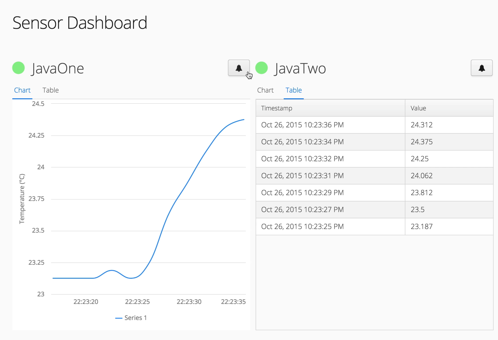

# Vaadin based MQTT sensor/alarm dasboard ui
 
To build, run `mvn install`. Run with any servlet container, or `mvn jetty:run` in the dashboard package.

The alarm expects to have a LED attached to the Raspberry PI GPIO_00

The sensor is wired as shown on https://learn.adafruit.com/adafruits-raspberry-pi-lesson-11-ds18b20-temperature-sensing/hardware

